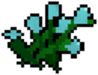

#  CTF Writeups

This repository contains the CTF challenges I have completed along with detailed write-ups. The structure is as follows: 

- The root directory contains the categories of challenges.
- Within each category, there is a folder for each challenge, named in the following format: "CTF Competition - Challenge Name"
- Each challenge folder contains a README file with the corresponding write-up.

## Categories

| Category  | Link                |
| --------- | ------------------- |
| Reverse   | [Link](/Reverse/)   |
| Forensics | [Link](/Forensics/) |

